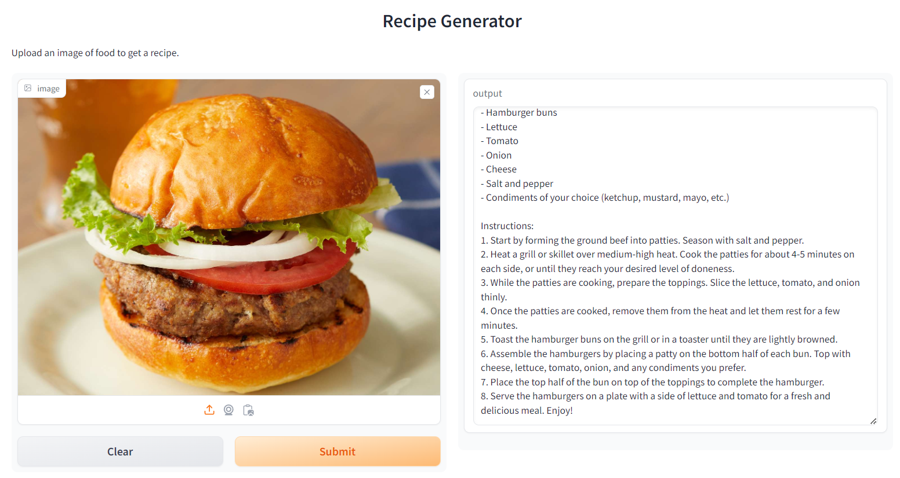

# RecipeAI Gradio App

## Overview

The RecipeAI Gradio App is a tool that generates recipes from food images. It leverages state-of-the-art AI models to interpret images of food, generate a description, and then use that description to provide a recipe. This project uses a combination of Hugging Face's `transformers`, `langchain`, `OpenAI`, and `Gradio` to create an easy-to-use web interface for recipe generation.



## Features

- **Image-to-Text Conversion**: Utilizes Salesforce's BLIP model to convert food images into textual descriptions.
- **Recipe Generation**: Uses OpenAI's GPT-3.5 model to generate a list of ingredients and a step-by-step recipe based on the description from the image.
- **User-Friendly Interface**: Provides an interactive web interface with Gradio to upload images and receive recipes.

## Installation

To run the RecipeAI Gradio App, you'll need to install the required packages. You can install them using pip. Run the following commands:

```bash
pip install datasets huggingface_hub
pip install -U transformers
pip install bitsandbytes==0.41.3 accelerate==0.25.0
pip install langchain
pip install openai langchain_openai
pip install typing_extensions
pip install pyttsx3
pip install gtts
pip install gradio
pip install langchain-community langchain-core
```

## Setup

1. **Obtain OpenAI API Key**: You need an OpenAI API key to access GPT-3.5. Make sure to set your OpenAI API key as an environment variable or provide it in the code.

2. **Code Configuration**:
   - Ensure you have the API key in your environment:
     ```python
     from google.colab import userdata
     OPENAI_API_KEY = userdata.get('OPENAI_API_KEY')
     ```
   - Update the model initialization if needed:
     ```python
     llm = ChatOpenAI(model_name="gpt-3.5-turbo", temperature=0, max_tokens=512, openai_api_key=OPENAI_API_KEY)
     ```

3. **Run the Application**:
   - Execute the script to start the Gradio app:
     ```python
     iface.launch(debug=True)
     ```

## Usage

1. **Upload Image**: Use the Gradio interface to upload an image of food.
2. **Receive Recipe**: The app will display the list of ingredients and a step-by-step recipe based on the image provided.

## Example

Here's how to use the application:

1. Open the app interface.
2. Upload an image of the food item.
3. Wait for the recipe to be generated and displayed on the screen.

